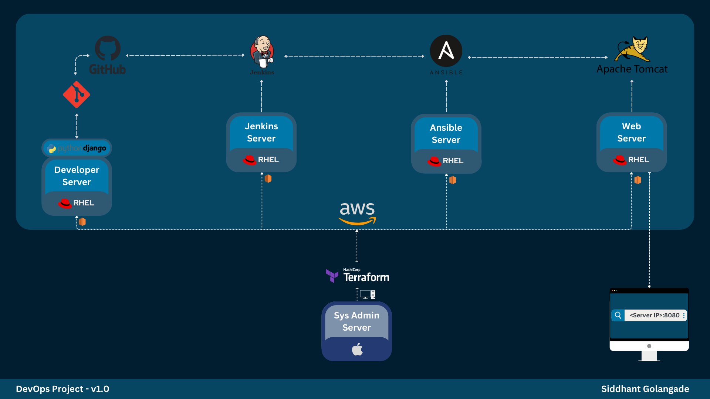

# DevOps Project - Automated Web App Deployment - v1.0

## Overview

This DevOps project aims to automate the deployment process of a Python-Django web application using a combination of tools and technologies such as AWS, Terraform, Jenkins, Ansible, Apache Tomcat, Git/GitHub, etc. 

## Project Architecture

## Project Steps
This section provides step-by-step instructions on how to set up the development environment, configure individual servers, and create a Jenkins pipeline for automated builds and deployments.

### Step 1: GitHub/VScode Setup

1. Create a GitHub repository for the application.
2. Open VScode and clone the application repository.
3. OPTIONAL: If using a web app from GitHub, download it to your local machine.
4. In VScode, open the cloned repository folder and add the application data.
5. Commit and push the changes to GitHub.

### Step 2: Terraform Setup & Configuration

1. Install and configure Terraform.
2. Create a `main.tf` file and paste the Terraform configuration.
3. Run `terraform init` to initialize the project.
4. Run `terraform apply -auto-approve -input=false` to apply the infrastructure changes.
5. Verify user_data installations by checking `/var/log/cloud-init-output.log`.

### Step 3: Individual Servers Configuration

#### GitHub Configuration:

1. Generate a Personal Access Token in GitHub.
2. Replace `<personal_access_token>` with the generated token.

#### Developer Server:

1. Clone the repository using the access token.
2. Commit and push the changes.

#### Jenkins Server:

1. Set up SSH key configurations for Jenkins and Ansible Servers.
2. Copy the initialAdminPassword for Jenkins login.
3. Access Jenkins on `http://<EC2-Public-IP>:8080`.
4. Install suggested plugins and additional plugins, including "Publish over SSH."
5. Configure Jenkins credentials.
6. Set up GitHub webhook for the repository.

#### Ansible Server:

1. Configure SSH settings for the Ansible Server.
2. Create a directory to store data from the Jenkins Server.
3. Create an Ansible playbook.

### Step 4: Jenkins Pipeline Configuration

1. Create a Jenkins Job as a Pipeline.
2. Enable "GitHub hook trigger for GITScm polling."
3. Choose "Pipeline Script from SCM" and specify the Repository URL.
4. Add Jenkins credentials for the Jenkins Server (SSH username and private key).
5. Specify `*/main` as the Branch Specifier.

### Step 5: Configuring Jenkinsfile from Developer Server

1. Login to the Developer Server.
2. Navigate to the `Web-Application-Repository` folder.
3. Create or edit the `Jenkinsfile` with the desired configuration.
4. Commit and push the changes to the GitHub repository.

### Step 6: Configuring Ansible Playbook from Ansible Server

1. Login to the Ansible Server.
2. Navigate to the `/home/ec2-user/ansible-data/ansible-playbooks` directory.
3. Create or edit the `deploy-web-app.yml` playbook with the desired configuration.

### Final Steps:

1. Run the Jenkins Job to trigger the pipeline and deploy the web application.
2. Access the Web Server's IP on port 8080 to interact with the deployed application.